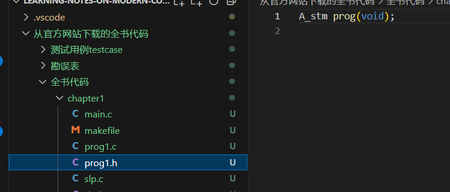
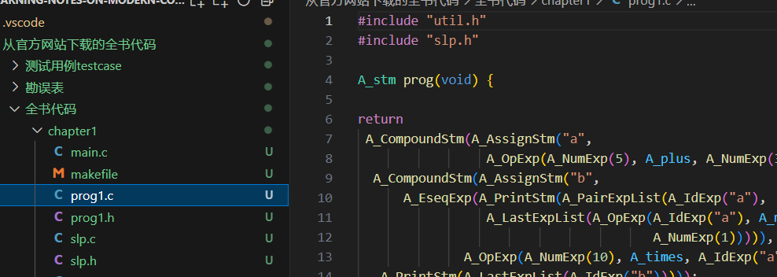

# Learning-notes-on-modern-compiler-implementation-in-c\n

## chapter1 ... chapterx 目录
这是我在随书代码基础上写的作业，有些答题类和每章我的感悟写在，其中的 README.md 中

## 书中、给的代码中错误的地方（在我的代码中已经修正）
### 头文件问题

在头文件中没有包含依赖项，而是在 .c 文件中包含了，导致编译错误。

### String 问题
.JPG)
应该是 string 而不是 String。